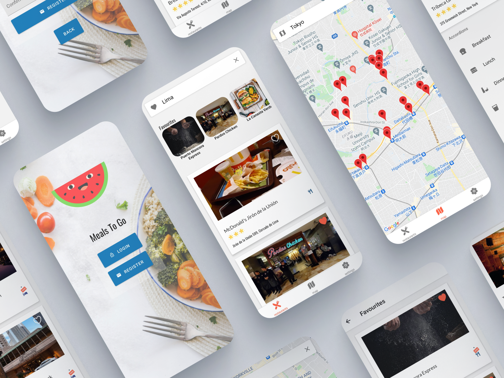

# MealsToGo 🍽️

Locate and mark the best restaurants around the world making use of the [google cloud services](https://cloud.google.com/)

# Screenshots

 

 

# Features

* Authentication and user accounts using Firebase and Firebase Functions
* Locate top restaurants using interactive maps provided by Google Maps API
* Find restaurants around the glove making use of Google Cloud Services such as places and geocoding API
* Mark your favorites restaurants and navigate between these
* Take profile pictures and save them using async storage

# Tools
## React native
* [React Native](https://reactnative.dev/) - Framework
* [React Native Maps](https://www.npmjs.com/package/react-native-maps) - Interactive maps
* [React Navigation](https://reactnavigation.org/) - Routing and navigation
* [React Native Paper](https://callstack.github.io/react-native-paper/) - Material-UI components
* [Expo](https://expo.dev/) - Developing and deployment
* [Expo Fonts](https://docs.expo.dev/versions/latest/sdk/font/) - Allows loading custom fonts
* [Expo Camera](https://docs.expo.dev/versions/latest/sdk/camera/) - Allows usage of front camera
* [Lottie](https://github.com/lottie-react-native/lottie-react-native) - Renders animations
* [Async storage](https://www.npmjs.com/package/@react-native-async-storage/async-storage) - Save data in the phone

## Google cloud services
* [Google Cloud](https://cloud.google.com/) - Google services
* [Google Places API](https://developers.google.com/maps/documentation/places/web-service/overview) - Information about restaurants
* [Google Geocoding API](https://developers.google.com/maps/documentation/geocoding/overview) - Convert address into coordinates

## More tools
* [Typescript](https://www.typescriptlang.org/) - Type safety
* [Prettier](https://prettier.io/) - Code formatter
* [Lodash](https://lodash.com/) - Javascript utilities
* [Styled components](https://styled-components.com/) - CSS in JS
* [React Use](https://github.com/streamich/react-use) - React utilities hooks
* [Firebase](https://firebase.google.com/) - Authentication and functions


# Deployment

[Expo](https://expo.dev/@oscaramos99/MealsToGo)

# To run this app
1. Clone this repo
2. Run ```yarn install```
3. Run ```yarn start```

# To run google functions locally
1. Clone this repo
2. Go to functions folder
2. Run ```yarn install```
3. Run ```yarn serve```

